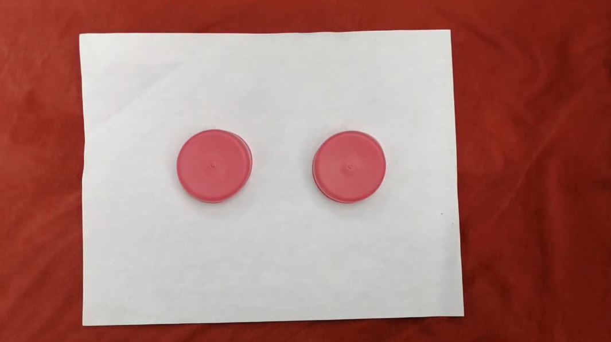
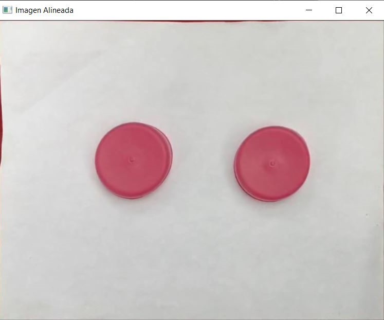
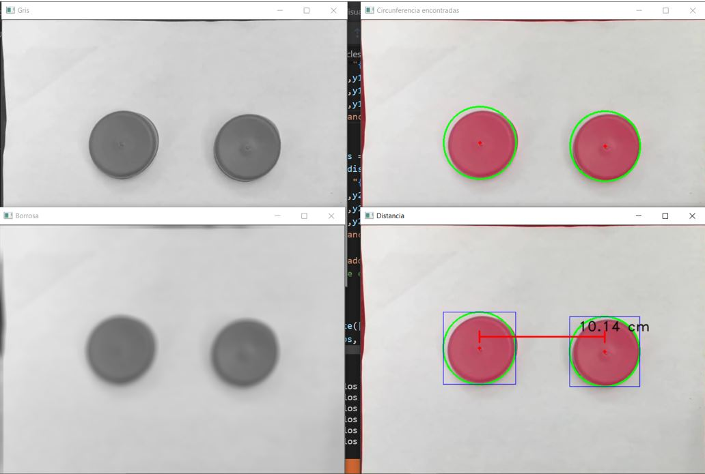

- [Cálculo de distancia con visión artificial basado en la transformada de Hough](#cálculo-de-distancia-con-visión-artificial-basado-en-la-transformada-de-hough)
  - [Importaciones](#importaciones)
  - [Definición de funciones](#definición-de-funciones)
    - [Función "main"](#función-main)
      - [Método `cv2.HoughCircles`](#método-cv2houghcircles)
    - [Función "roi"](#función-roi)
    - [Función "ordenar puntos"](#función-ordenar-puntos)
    - [Función "distancia"](#función-distancia)

# Cálculo de distancia con visión artificial basado en la transformada de Hough

Este código, fue diseñado para calcular la distancia aproximada en centímetros, que existen entre dos objetos circulares. Para ello, se usó como referencia de medida una hoja tamaño carta. Se proporcionó un valor deseado en pixeles a un lado de la hoja, y el otro lado fue calculado con ayuda de la regla de tres.

Para aplicar la regla de tres, suponemos que los lados de la hoja tamaño carta son **a** y **b** conocidos en centímetros, equivalentes a **x** y **y** desconocidos en pixeles respectivamente. Se propone un valor ya sea de **x** o de **y**, y se compara de tal manera que si **a** en centímetros, es igual a **x** siendo el valor propuesto en pixeles, ¿cuánto sería **y** en pixeles conociendo el valor de **b** en centímeros? De esta manera se se haría el producto de **b** con **x**, dividiendo el resultado anterior por **a**; obteniendo el valor de **y**.

Ahora bien, con los datos contemplados anteriormente, se realiza cada parte del código para obtener un buen resultado de la distancia entre los dos círculos. EL código puede ser usado con una cámara en tiempo real, el problema es que aún es muy sensible a interrupciones y este se detiene marcando error.

Con respeto al código, se puede observar más adelante una breve explicaión del funcionamiento de las funciones.

## Importaciones

Para este pequeño proyecto solo se han necesitado de las dos siguientes librerías:

* **cv2**: es ideal para el procesamiento de imágenes
* **numpy**: es una libraría de multiples usos

```python
import cv2 
import numpy as np
```

## Definición de funciones

Ya que este este programa esta enfocado a tomar muchas veces la imagen de un video grabado o de una cámara en tiempo real, quedará ciclado con un `while`; donde este será detenido de dos maneras, hasta que ya no se detecte imagen alguna, o ya sea usando una tecla definida; en este caso la letra **s**.

```python
while True:
    ret, frame = cap.read()
    if ret == False: #Detiene el proceso cuando no hay imagen
        print("No se detecta imágen")
        break
    elif cv2.waitKey(1) & 0xFF == ord('s'): #Detener el proceso con s en 64 bits
        break
    main(frame)
```

### Función "main"

Esta es la función principal que llamará al resto de las funciones. Entre estas llamadas está el método de `cv2.HoughCircles` quién se encargará de encontrar los circulos disponibles en la imagen que se reciba. Los parámetros que incluye esta función son los siguientes en el orden en que se muestra en el código de abajo:

#### Método `cv2.HoughCircles`

* **Primer parámetro**: imagen original en estado de grises (`gray = cv2.cvtColor(img, cv2.COLOR_BGR2GRAY`) con el filtrado pasa bajos (`gray_blurred = cv2.blur(gray, (11, 11))`). La imagen de estos resultados se muestra al final.
* **Segundo parámetro**: método fijo de Hough para este caso.
* **Tercer parámetro**: este es la relación inversa de la resolución del acumulador, lo ideal es usar 1; ya que de esta forma se tendría la misma resolución que la imagen.
* **Cuarto parámetro**: distancia mínima (en pixeles) entre el centro y las circunferencias detectadas.
* **Quinto parámetro**: al usar el método `HOUGH_GRADIENT`, este sería el umbral máximo en la detección de bordes por Canny.
* **Sexto parámetro**: al igual que el anterior, este sería el umbral mínimo en la detección de bordes por Canny.
* **Septimo parámetro**: círculos con el radio mínimo a encontrar.
* **Octavo parámetro**: círculos con el radio máximo a encontrar.

```python
detected_circles = cv2.HoughCircles(gray_blurred, cv2.HOUGH_GRADIENT, 1, 15, param1 = 20, param2 = 30, minRadius = 60, maxRadius = 75)
```

La variable anterior habrá recolectado los datos de cada círculo hallado en la imagen (Cabe mencionar que solo se necesitaran de dos circulos, no más; cosa que se explica más a detalle en la función de ["distancia"](#función-distancia)), como son las coordenadas en **x** y **y** del centro de cada círculo en pixeles y el radio de los mismos igual en pixeles.

```python
if detected_circles is not None: 
        # Convertir los parámetros el círculo a, b, y r en enteros
        detected_circles = np.uint16(np.around(detected_circles))
        puntos = []
        for pt in detected_circles[0, :]: 
            a, b, r = pt[0], pt[1], pt[2] 
            # Dibujar la circunferencia
            datos = [a, b, r, r]
            puntos.append(datos)
            cv2.circle(img, (a, b), r, (0, 255, 0), 2) 
            # Mostrar los datos de las circunferencias
            print("Centro ({:}, {:}), radio = {:}".format(a, b, r))
            # Dibujar un círculo pequeño alrededor del centro
            cv2.circle(img, (a, b), 1, (0, 0, 255), 3)
            # Ir mostradndo las circunferencias detectadas
            cv2.imshow("Circunferencia encontradas", img)         
        distancia(puntos, img) #Llamada a la funcion distancia con los puntos recolectados
```

Cabe aclarar, que imprimir los datos de cada círculo así como mostrar la imagen dibujando la circunferencia de cada circulo hallado, no es necesario; ya que lo que se desea, es hallar la distancia entre ellos. Solo se colocan para que se visualice lo que se está realizando. Ahora bien, si se comentan algunas líneas inecesarias, el proceso sería más veloz.

### Función "roi"

La palabra "ROI" que significa "Región de Interés", se encargará de limitar el espacio de trabajo al detectar la hoja tamaño carta en la imagen recolectada. Esta función recibirá tres parámetros, la imagen que se analizará, el alto y el ancho en pixeles obtenidos como se explica al inicio. Durante el proceso también se analiza si la imagen no esta inclinada, si fuera o no así, se manda a la función llamada ["ordenar_puntos"](#función-ordenar-puntos) para que la imagen se aproxime a una vista perpendicular, vista desde la parte superior; y así, se regresaría el resultado de la imagen recortada y alineada.

Las siguientes dos imágenes muestran la imagen original recolectada del video y la segunda imagen es la recortada y alineada.

<div style="text-align:center"></div>

<div style="text-align:center"></div>

### Función "ordenar puntos"

La finalidad de esta función es enderezar la hoja tamaño carta de tal forma que los lados queden en paralelo con la pantalla lo mejor que se pueda. El resultado de esta función junto con la anterior, es la imagen que se muestra anteriormente.

### Función "distancia"

Por último, la función más importante. Aquí es donde se realiza el cálculo de la distancia y se muestra en pantalla el resultado hallado en **centímetros**.

Esta función recibe dos parámetros, los datos de todos los círculos encontrados, y la imagen alineada.

```python
def distancia(puntos, img):
```

Antes de que se continue el proceso del cálculo, se verifica de que solo se tengan los valores de dos círculos, en caso contrario se mandará un mensaje como se muestra en el código de abajo y se vuelve a comenzar todo el proceso hasta tener solo los datos de dos círculos.

```python
if len(puntos) == 2:
    #Código para calcular distancia
else:
    print("Se han detectado 1 o más de 2 circulos")
    #print("Verifique que el lugar este bien iluminado") #Mensaje extra cuando se trata de cámara en tiempo real
```

Una vez se tengan los valores de solo dos círculos se pasarán a otras variables para que sea más simple su uso. Donde **x** y **y** serán el centro del círculo, y **w** y **h** serán el alto y ancho del mismo; aúnque en este caso en específico por usar Hough se trata de círculos y no de ovalos, por lo tanto los valores de **w** y **h** son los mismos (siendo en sí ambos el radio). Se pone de esta forma por si se pretende usar otro método en un futuro.

```python
x1, y1, w1, h1 = puntos[0]
x2, y2, w2, h2 = puntos[1]
```

Las siguientes dos líneas de código son de mayor utilidad, para lo que ya se explicaba anteriormente, al usar un método donde no sean exactamente círculos sino ovalos. Estas dos líneas se encargaran de encerrar el círculo o ovalo en un rectangulo.

```python
cv2.rectangle(img, (x1-w1, y1-h1), (x1+w1, y1+h1), (255, 0, 0), 1)
cv2.rectangle(img, (x2-w2, y2-h2), (x2+w2, y2+h2), (255, 0, 0), 1)
```

Ahora bien, se pasa a la parte del cálculo de la distancia entre ellos. En el código de abajo incluye los dos caso; cuando **x1<x2** o cuando **x2<x1**. Y así, ya que se conozca el valor de la distancia entre ellos en centímetros, pasando los pixeles a centímetros con la relación que se hizo desde un principio, se mostrará ese dato en la imagen con `cv2.putText`, incluyendo unas líneas para hacer referencia de a dónde a dónde es ese resultado.

```python
if x1 < x2:
    distancia_pixeles = abs(x2 - x1) #Cálculo de dsitancia en pixeles
    distancia_cm = (distancia_pixeles)/21.5 #Cálculo de distancia en cm
    cv2.putText(img, "{:.2f} cm".format(distancia_cm), (x1-w1+distancia_pixeles//2, y1-30), 2, 0.8, (0,0,0), 1, cv2.LINE_AA)
    cv2.line(img,(x1,y1-20),(x2, y1-20),(0, 0, 255),2) #Línea horizontal
    cv2.line(img,(x1,y1-30),(x1, y1-10),(0, 0, 255),2)
    cv2.line(img,(x2,y1-30),(x2, y1-10),(0, 0, 255),2)
    cv2.imshow('Distancia',img)
    #cv2.waitKey(0)
else:
    distancia_pixeles = abs(x1 - x2) #Cálculo de dsitancia en pixeles
    distancia_cm = (distancia_pixeles)/21.5 #Cálculo de distancia en cm
    cv2.putText(img, "{:.2f} cm".format(distancia_cm), (x2-w2+distancia_pixeles//2, y2-30), 2, 0.8, (0,0,0), 1, cv2.LINE_AA)
    cv2.line(img,(x2,y2-20),(x1, y2-20),(0, 0, 255),2) #Línea horizontal
    cv2.line(img,(x2,y2-30),(x2, y2-10),(0, 0, 255),2) #Línea izquierda
    cv2.line(img,(x1,y2-30),(x1, y2-10),(0, 0, 255),2) #Línea derecha
    cv2.imshow('Distancia',img)
```

El resultado obtenido usando el video incluido en este repositorio (hoja2.mp4), es el siguiente:

<div style="text-align:center"></div>
